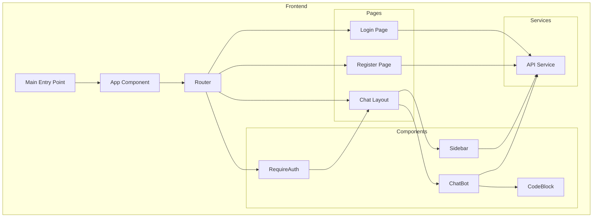

    

    <b>Automatic Architecture Diagrams from Code</b> 
    <a href="https://github.com/swark-io/swark">GitHub</a> • <a href="https://swark.io">Website</a> • <a href="mailto:contact@swark.io">Contact Us</a>

## Usage Instructions

1. **Render the Diagram**: Use the links below to open it in Mermaid Live Editor, or install the [Mermaid Support](https://marketplace.visualstudio.com/items?itemName=bierner.markdown-mermaid) extension.
2. **Recommended Model**: If available for you, use `claude-3.5-sonnet` [language model](vscode://settings/swark.languageModel). It can process more files and generates better diagrams.
3. **Iterate for Best Results**: Language models are non-deterministic. Generate the diagram multiple times and choose the best result.

## Generated Content
**Model**: GPT-4o - [Change Model](vscode://settings/swark.languageModel)  
**Mermaid Live Editor**: [View](https://mermaid.live/view#pako:eNp1UstuwyAQ_BXEOfkBHyo5SStFSiUr6Q1yIPbGRrXBxVDJivLv5WXsRM0BmJ2B3fWsb7iUFeAMU1Er1jfoa0cFQoO5hPBDSaFBVI5EKO97Yhfayq6XAoQ-B_6TcUHcht6FViMqJE_aURoNioQjcil9wWoYAofQQdY2jd-9cJ6EI9R88EkieJS3DdMHNtoCxEEUcJRT76lman6Y8_8YriA3uiELnAqceAUXpkg8HwpvZKhqz5m3lm5aWX6ThF52cwL1y8vZhLzYE7sm_vGdPxzwXq_Xb24iLnZDcWFw2TEBedI7-sRNTj7Rs5VOmCMvxs__R4kGTIqFobli76j4bkmFIS-INNklt2w3TSXcTuGLtqcW0gCowCvcgeoYr-zvfqNYN9ABxRmiuIIrM62m-G4vmb5iGnac2QF1ONPKwAozo-VpFOUUK2nqBmdX1g5w_wPHAhGr) | [Edit](https://mermaid.live/edit#pako:eNp1UstuwyAQ_BXEOfkBHyo5SStFSiUr6Q1yIPbGRrXBxVDJivLv5WXsRM0BmJ2B3fWsb7iUFeAMU1Er1jfoa0cFQoO5hPBDSaFBVI5EKO97Yhfayq6XAoQ-B_6TcUHcht6FViMqJE_aURoNioQjcil9wWoYAofQQdY2jd-9cJ6EI9R88EkieJS3DdMHNtoCxEEUcJRT76lman6Y8_8YriA3uiELnAqceAUXpkg8HwpvZKhqz5m3lm5aWX6ThF52cwL1y8vZhLzYE7sm_vGdPxzwXq_Xb24iLnZDcWFw2TEBedI7-sRNTj7Rs5VOmCMvxs__R4kGTIqFobli76j4bkmFIS-INNklt2w3TSXcTuGLtqcW0gCowCvcgeoYr-zvfqNYN9ABxRmiuIIrM62m-G4vmb5iGnac2QF1ONPKwAozo-VpFOUUK2nqBmdX1g5w_wPHAhGr)

